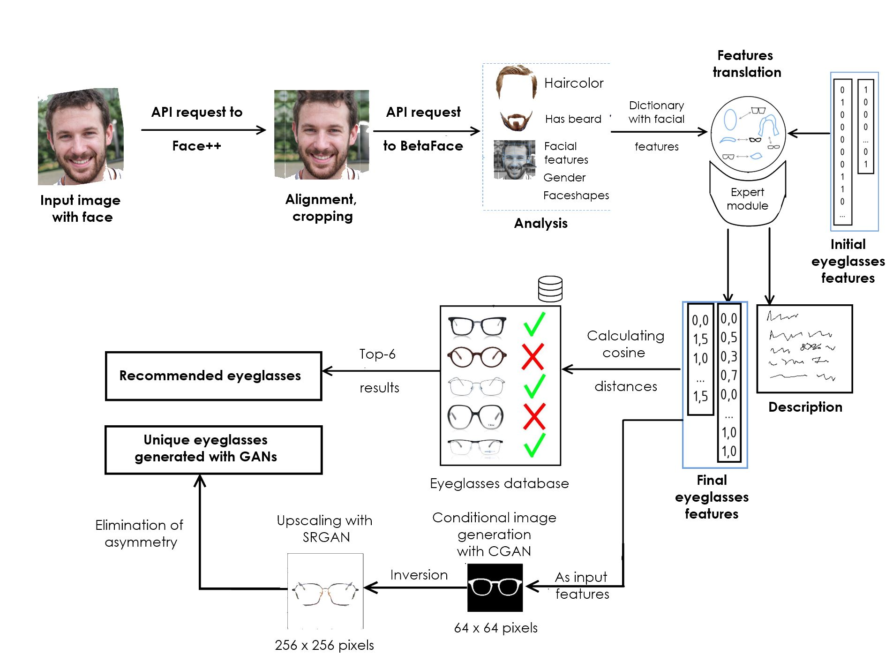
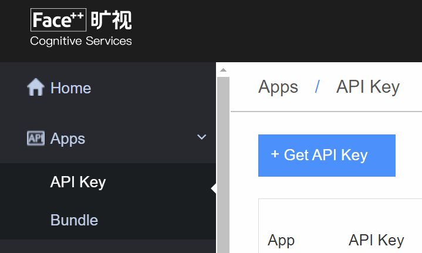
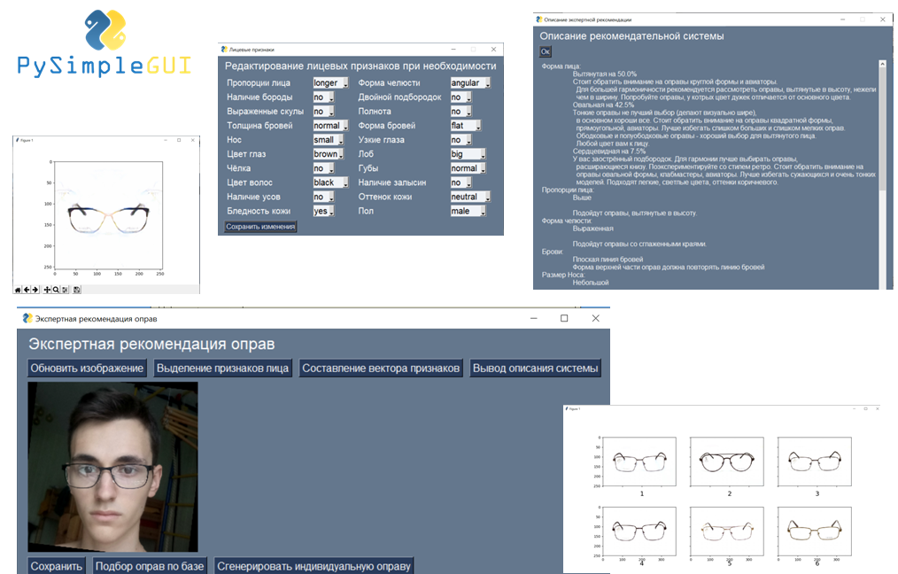
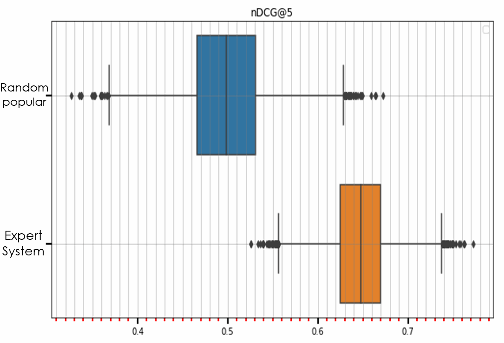

# ExpertGlasses

<p align="center">
      
</p>

Expert eyeglasses recommendation system with Generative Adversarial Networks written in Python, 2020.

Live Demo: [Glasses:eyes:Expert](http://glasses-expert.herokuapp.com/)
____

## Table of Contents
  * [Description](#description)
  * [Installation](#installation)
  * [Reminder about API-services](#reminder-about-api-services)
  * [Additional features](#additional-features)
    + [Download pretrained GAN models](#download-pretrained-gan-models)
    + [Download images for A/B testing](#download-images-for-ab-testing)
  * [How to use ExpertGlasses](#how-to-use-expertglasses)
    + [In code](#in-code)
    + [GUI](#gui)
  * [Performance benchmarks](#performance-benchmarks)
  * [Sources](#sources)
____
## Description

The task of recommending eyeframes based on people's appearance is quite hard and there are no similar projects available at the moment. This system takes into account over 20 facial attributes, maps them into eyeglasses features with the help of expert module (which consists with over 40 branches). Expert module apply written beforehand rules to get necessary mappings. High interpretability of such approach guaranties user's understanding and loyality towards the system.

To get necessary attributes from the photo this system uses bunch of machine learning algorithms and existing free services, i.e [BetaFaceAPI](https://www.betafaceapi.com/wpa/) and [Face++](https://www.faceplusplus.com/). Face++ allows to locate bounding boxes of faces in images, while BetaFace uses various classifiers to get most of the secondary-importance features. So to use this repository, you should have access to the internet.

To detect face shape probabilities, iris color, forehead size, jawtype type, skintone the system uses own pretrained convolutional neural networks (CNNs). These models run on your local machine on CPU.

To get all necessary eyeframes attributes, the large dataset (>8k records) of eyeframes was parsed and processed. Because in real life there are not so many eyeframe models in the local shop available, the generation of unique eyewear by given features was implemented. The system use a conditional GAN followed by Super Resolution GAN to create non-existing high-definition images of the eyeframes.

____

## Installation
Requirements:
* Python 3.6 or greater
* requests
* numpy
* pandas
* opencv_python_headless
* scikit_image
* tensorflow
* Keras_Applications
* PySimpleGUI

For the full list of requirements consider to check requirements.txt

To install repository, use the following commands:

__`Windows`__:

    $ git clone https://github.com/Defasium/expertglasses
    $ cd expertglasses/
    $ pip3 install -r requirements.txt

__`Linux`__:

    $ git clone https://github.com/Defasium/expertglasses
    $ cd expertglasses/
    $ sudo pip3 install -r requirements.txt

__`Linux`__ inside virtualenv:

    $ git clone https://github.com/Defasium/expertglasses
    $ cd expertglasses/
    $ pip3 install -r requirements.txt


## Reminder about API-services

__In current version without Face++ api key you can't use Expert Recommender System!__

While BetaFace api has the same free api key for everyone with some limitations, allowing you to upload up to 500 images from your IP per day. Face++ utilizes a different strategy, requiring you to create an account on their site. In this account you can generate your own free api key and api secret in the Apps -> API key section:

<p align="center">
      
</p>

After that consider changing values of API_KEY and API_SECRET in the [faceplusplus.py](faceplusplus.py) module:
```Python

...
API_KEY = "api_key"
API_SECRET = "api_secret"
RETURN_ATTRIBUTES = "gender,beauty,age,smiling,headpose,ethnicity,skinstatus"
RETURN_LANDMARK = 1
...
```

## Additional features

In the github repository there are no currently some functionality, e.g. pretrained GAN models and best selling eyeglasses. If you want to include this features in the system, you need to download necessary files. Links are listed bellow.  

### Download pretrained GAN models
| Storage Service | Link |
| ---- | ----------- |
| <p align="center"></p>|[GDrive](https://drive.google.com/drive/folders/12KfsfZH25Ov7HvFVeIFVpANjvcjRthCf)|
| <p align="center"></p>|[DropBox](https://www.dropbox.com/sh/iwolbxkr90rkuic/AABifNPYEQVO_t9wfycTy9upa?dl=0)|
| <p align="center"></p>|[Mega](https://mega.nz/folder/JpdDmA4C#ou62DrQCzo4uhs_qt8iACw)|


Download 2 files, __cgan.h5__ and __srgan.h5__, and place them in __utils/__ directory. 

### Download images for A/B testing
| Storage Service | Link |
| ---- | ----------- |
| <p align="center"></p>|[GDrive](https://drive.google.com/file/d/1aL60K5BX1kXQuM5xJC_jg9VMorPgotpL)|
| <p align="center"></p>|[DropBox](https://www.dropbox.com/s/s00vugkaau9twcs/abtest.zip?dl=0)|
| <p align="center"></p>|[Mega](https://mega.nz/folder/Bt9SRKqI#sjmJPOKF2VWgNxgt80ItmQ)|

Download files, create a directory named __abtest/__ and extract __man/__ and __woman/__ directories inside of it.

## How to use ExpertGlasses

At the current state there are only 2 ways of using expert eyeglasses recommender system: in your python code and via GUI.

### In code

To use this system, simply import class in your python code:
```Python
from expert_backend import ExpertEyeglassesRecommender
```

After that create an instance of this class with a specified path to the image:
```Python
ins = ExpertEyeglassesRecommender('test.jpg')
```
Initialization of class may take quite a long time (from 30 second up to 2 minutes). 
____

After initialization recomendations will be completed and to get the top 6 best images of eyeglasses use:
```Python
ins.plot_recommendations()
```
By changing strategy value you can obtain different results:
```Python
# in standart strategy feature with the biggest value impacts the results the most
ins.plot_recommendations(strategy='standart')

# in factorized strategy (default value) features are divided into three main groups:
# shape of eyewear, its rim and other features, thus making results more various
ins.plot_recommendations(strategy='factorized')

# in factorized plus strategy every feature greatly influence the final result
# thus providing many varios nonsimilar eyeframes
ins.plot_recommendations(strategy='factorized_plus')

# in color only strategy the resulting images will have the same color as in color vector
ins.plot_recommendations(strategy='color_only')

# shape only strategy's results are similar to standart's one but doesn't take into account color
ins.plot_recommendations(strategy='shape_only')
```
If you have [__downloaded abtest directory__](#download-images-for-ab-testing), you can also try recommending random most popular eyeglasses (so the system don't use any information about your appearance):
```Python
# will output 6 randomly chosen eyeglasses 
ins.plot_recommendations(strategy='most_popular')
```
____

To get explanation of the system try:
```Python
print(ins.description)
```
__In the current version the only possible language for description is russian!__
____

To work with new image use:
```Python
ins.update_image('test2.jpg')
ins.expert_module()
```

You can alse use url as an argument:
```Python
ins.update_image('https://github.com/Defasium/expertglasses/blob/master/assets/gui.png?raw=true')
ins.expert_module()
```

____

To generate unique image with GANs (implying that you have downloaded pretrained models, look [__Download pretrained GAN models__](#download-pretrained-gan-models) section) use:
```Python
image = ins.generate_unique(show=True)
```
Will generate eyeglasses according to features, plot it with matplotlib if show is True and returns an numpy.ndarray
____

### GUI

__In the current version the only possible language for interface is russian!__

<p align="center">

</p>

Graphical user interface is powered by PySimpleGui framework, which allows fast and simple prototyping for cross-platform systems.

To launch GUI, use the following command from terminal:

    $ python gui.py
    
In the first popup window you should load an image to process, i.e. the fast start, module would automatically calculate all the necessary stuff in background. After that all machine learning models will be loaded in RAM (loading usually takes from 30 seconds up to 2 minutes). When progressbar will be filled, the main interface will appear.

____

## Performance benchmarks

In this section you can find information about current performance of the system, speed benchmarks and so on.

Speed benchmarks were tested on 2 different machines:
 * Windows 10 with 4 cores 2.3 GHz Intel® Core™ i5-4200U and 4 GB of RAM (low spec)
 * Linux Ubuntu 16.04 LTS with 4 cores 3.4 GHz Intel® Core™ i7-4770 and 20 GB of RAM (high spec)

The results are listed below:
 

|Action|Time, low spec|Time, high spec|Standart deviation, low spec|Standart deviation, high spec|
|:--------------|:--:|:--:|---:|---:|
|Image alignment|4.7s|__3.9s__|2.4s|__0.5s__|
|Cached image alignment|62.0ms|__39.1ms__|55.0ms|__5.7ms__|
|BetaFace api request|__1.5s__|1.6s|0.4s|__0.4s__|
|Cached betaFace api request|2.0μs|__0.7μs__|__0.2μs__|0.3μs|
|Extraction of facial attributes|2.7s|__2.3s__|1.6s|__1.2s__|
|Cached extraction of facial attributes|3.0μs|__2.4μs__|__0.1μs__|1.8μs|
|Features translation|0.78s|__0.11s__|0.62s|__0.54s__|
|Cached features translation|15.0μs|__3.2μs__|12.1μs|__1.6μs__|
|Database search with cosine distances|1.1s|__0.8s__|0.4s|__0.4s__|
|Unique eyeglasses generation|4.2s|__4.0s__|__0.2s__|1.4s|
|Initialization of class instance|44.7s|__27.2s__|__1.9s__|2.7s|

____

To measure quality of recommendations A/B testing was made with ~50 participants. After that normalized discounted cumulative gain at top 5 items was calculated. The results are shown below:

<p align="center">
  
</p>

As you can see, expert recommender system outperforms the results of randomly chosen best selling eyeframes. 
____

## Sources

For classifiers this system uses modified version of ShuffleNetV2, implemented by [@opconty](https://github.com/opconty/keras-shufflenetV2).

For upscaling generated images this system uses modified version of [@krasserm](https://github.com/krasserm/super-resolution) Super Resolution GAN implementation.


